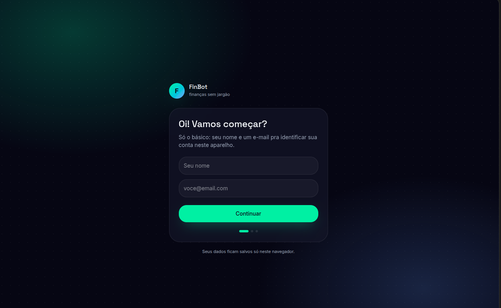
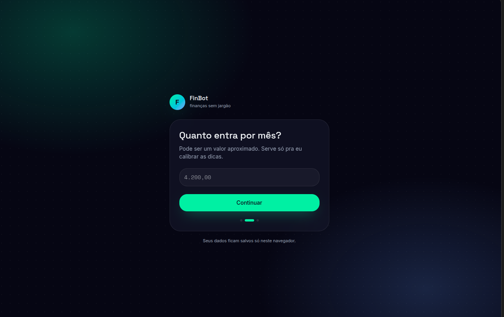
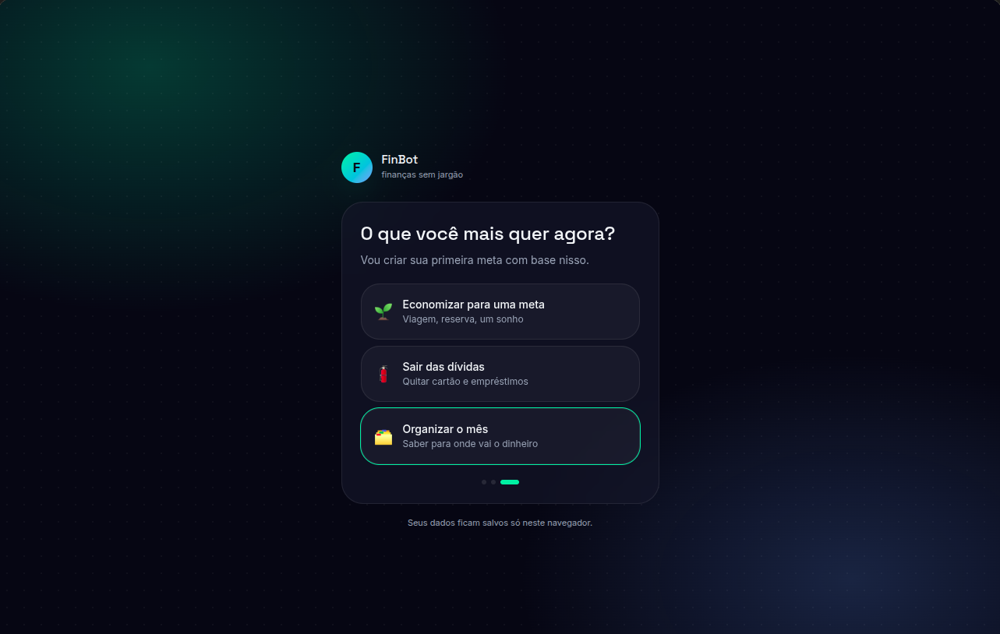
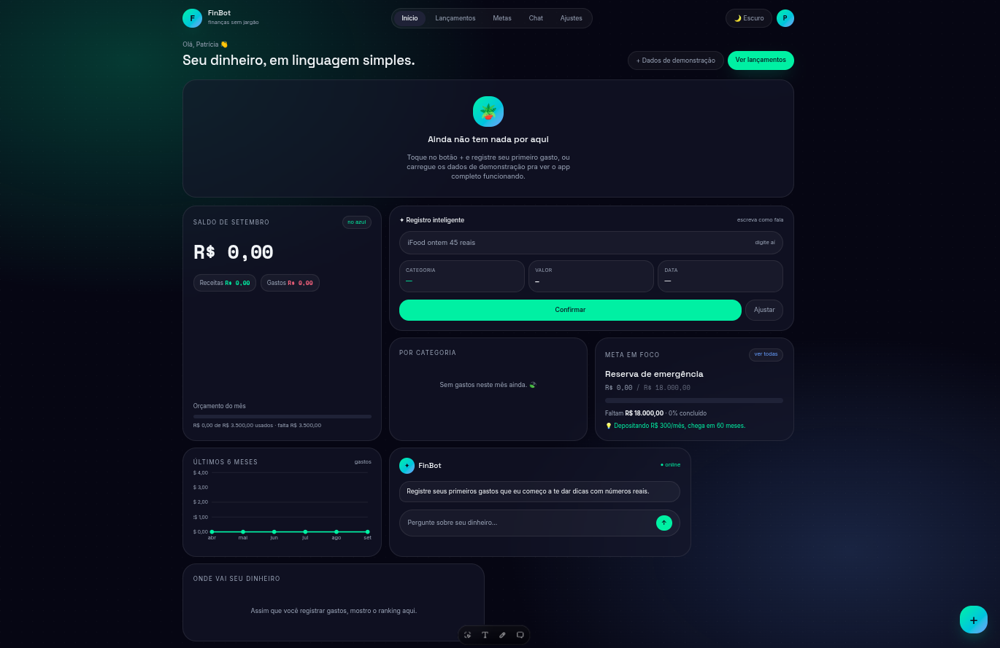
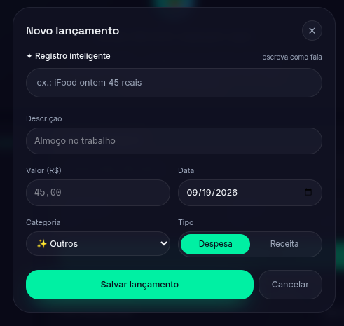
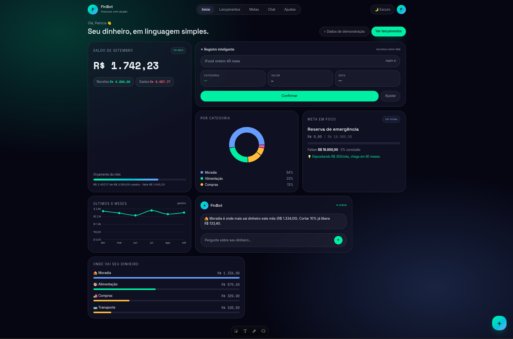
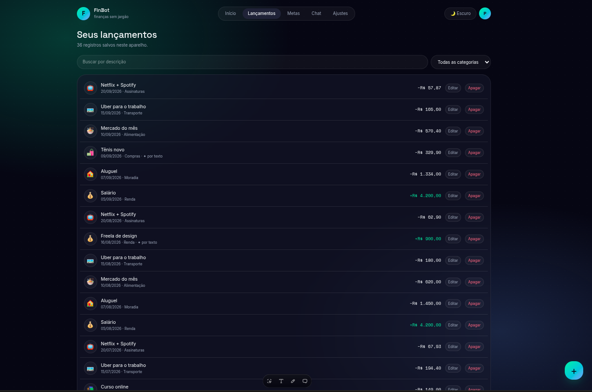
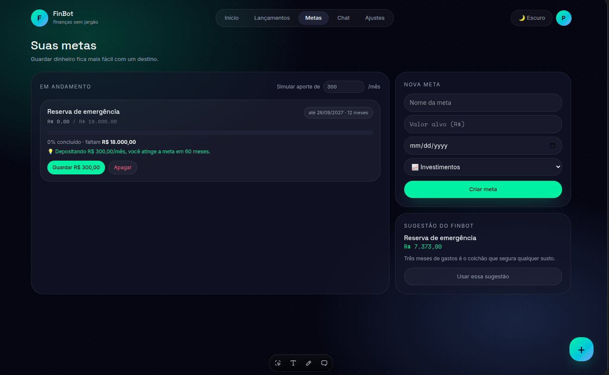
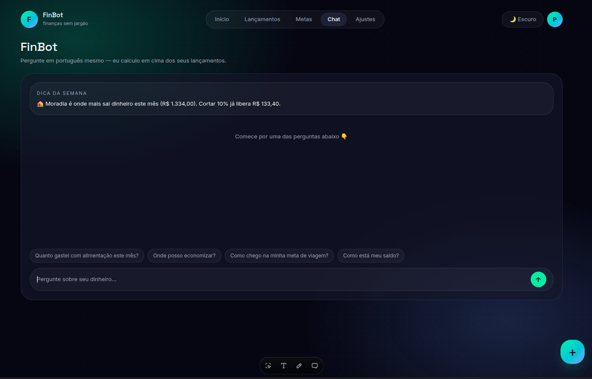
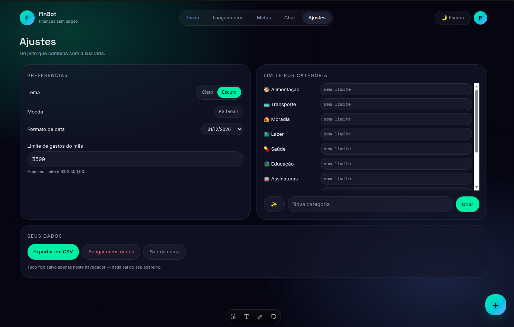

# 💸 FinBot · Finanças sem jargão

> Desafio do bootcamp **Criando produtos com IA** · Riachuelo + DIO
> Projeto 1: App de Organização de Finanças Pessoais com IA, construído
> com vibe coding (Lovable + IA generativa)


**Seu dinheiro, em linguagem simples. Controle de gastos, metas
financeiras e um assistente de IA em um só lugar.**


---

## ✨ Resumo do conceito

O **FinBot** nasceu de uma necessidade simples: a maioria das pessoas
não organiza as finanças porque o processo exige planilha, disciplina
e vocabulário de banco. O app resolve isso unindo três frentes em uma
experiência única:

- **Registro inteligente:** o usuário escreve como fala, por exemplo
  "iFood ontem 45 reais", e o app preenche automaticamente descrição,
  valor, data e categoria.
- **Metas financeiras:** acompanhamento visual do progresso, simulador
  de aportes e sugestões inteligentes baseadas na saúde financeira
  do usuário.
- **Assistente de IA (FinBot):** um chat que responde perguntas sobre
  os dados reais do usuário, em linguagem natural, e entrega uma
  "Dica da Semana" personalizada com impacto calculado.

O diferencial é a linguagem simples: o app traduz a vida financeira
do usuário em orientações claras e acionáveis, sem jargão bancário.
Todos os dados ficam salvos apenas no navegador, priorizando a
privacidade e a soberania do usuário sobre as próprias informações.

---

## 🚀 Funcionalidades

- **Registro Inteligente:** insira despesas escrevendo naturalmente
  ("iFood ontem 45 reais") e o sistema preenche os campos sozinho.
- **Dashboard Financeiro:** visão clara do saldo atual, receitas,
  despesas e orçamento do mês.
- **Análise por Categoria:** gráficos intuitivos para identificar onde
  o dinheiro está sendo gasto.
- **Histórico e Tendências:** gráfico dos últimos 6 meses para
  monitorar o comportamento financeiro.
- **Gestão de Lançamentos:** histórico completo com busca, filtros por
  categoria, edição e exclusão.
- **Gestão de Metas:** cadastro com nome, valor alvo, prazo e
  categoria, com barra de progresso e simulador de aportes.
- **Chat FinBot:** respostas calculadas sobre os dados reais, como
  "Quanto gastei com alimentação este mês?" ou "Onde posso economizar?".
- **Dica da Semana:** sugestões personalizadas de economia baseadas
  nos hábitos de consumo.
- **Configurações:** tema claro e escuro, limites de gastos por
  categoria, formatos de data e moeda, exportação em CSV e logout.

---

## 📝 O prompt final (PRD) usado com a IA

Este é o prompt completo (Product Requirements Document) utilizado na
ferramenta de vibe coding para gerar o produto. Foi construído para ser
autossuficiente: descreve visão, público, funcionalidades, fluxo,
interface e arquitetura de dados.
```markdown
# PRD: FinBot, App de Finanças Pessoais com IA

## 1. Visão do produto
App mobile-first e web responsivo de finanças pessoais que combina
controle de gastos, metas financeiras e um assistente de IA em uma
única experiência. O diferencial é a linguagem simples: o app traduz
a vida financeira do usuário em orientações claras e acionáveis,
sem jargão bancário.

## 2. Público-alvo
Qualquer pessoa que queira organizar as próprias finanças, sem
conhecimento prévio de planilhas ou mercado financeiro. Inclui
estudantes, famílias e profissionais autônomos.

## 3. Funcionalidades principais

### 3.1 Controle de gastos
- Registro de transações com valor, descrição, data e categoria.
- Categorias padrão: Alimentação, Transporte, Moradia, Lazer, Saúde,
  Educação, Assinaturas, Compras, Renda, Investimentos, Outros.
- Categorização automática por IA: ao digitar "iFood ontem 45 reais",
  o app identifica descrição, valor, data e categoria sugerida.
- Edição e exclusão de transações.

### 3.2 Dashboard financeiro
- Saldo do mês atual (receitas menos despesas).
- Gastos por categoria em gráfico de rosca.
- Evolução dos gastos nos últimos 6 meses em gráfico de linhas.
- Ranking das categorias que mais consomem o orçamento.

### 3.3 Metas financeiras
- Criação de metas: nome, valor alvo, prazo e categoria.
- Barra de progresso com percentual e valor faltante.
- Simulação de aporte mensal: "depositando R$ 300/mês, você atinge
  a meta em X meses".
- Sugestão de meta baseada no padrão de gastos do usuário.

### 3.4 Assistente de IA (FinBot)
- Chat que responde sobre as finanças do usuário, calculando em cima
  dos dados reais.
- Dicas semanais personalizadas com impacto calculado.
- Recomendações em linguagem simples, sem termos técnicos.

### 3.5 Configurações
- Moeda R$, formato de data, limite de orçamento mensal e por
  categoria, exportação CSV, tema claro e escuro.

## 4. Fluxo principal
Onboarding com perfil e objetivo → sugestão da primeira meta →
registro de transações (manual ou com IA) → acompanhamento no
dashboard e metas → conversa com o FinBot.

## 5. Requisitos técnicos
- Banco de dados: usuarios, transacoes, metas, categorias.
- Autenticação simples por e-mail.
- Arquitetura pronta para receber API de IA de categorização e chat.

```

## 🖼️ Telas do app

Registro do processo de construção por vibe coding, do prompt inicial ao produto final:

| Print | Descrição |
| --- | --- |
|  | **Onboarding:** tela "Oi! Vamos começar?" com cadastro de nome e e-mail |
|  | **Onboarding:** pergunta "Quanto entra por mês?" com renda de R$ 4.200,00 |
|  | **Onboarding:** escolha do objetivo ("O que você mais quer agora?") com "Organizar o mês" selecionado |
|  | **Dashboard:** saldo, orçamento, gráfico de 6 meses, metas e chat FinBot |
|  | **Novo lançamento:** registro inteligente "iFood ontem 45 reais" com preenchimento automático |
|  | **Visão geral:** saldo, receitas, despesas e tendências dos últimos meses |
|  | **Histórico:** lista de lançamentos com busca, filtros, edição e exclusão |
|  | **Metas:** progresso, simulador de aportes e sugestões inteligentes |
|  | **Chat FinBot:** respostas sobre os dados reais e "Dica da Semana" |
|  | **Configurações:** tema claro/escuro, limites, exportação CSV e privacidade |
